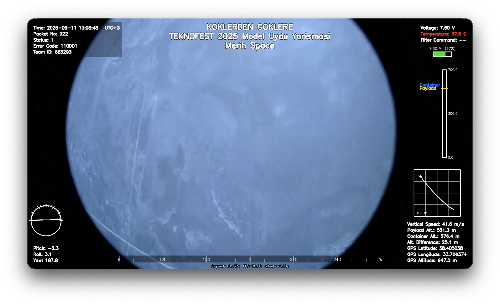

# Video Telemetry Overlay

A Python tool that displays video footage and CSV telemetry data **synchronously** to speed up post-flight evaluations.  
Uses OpenCV, Pillow, NumPy, Pandas, and python-dateutil.

https://github.com/ibrhmysil/video-telemetry-overlay

## 🎬 Demo


## ✨ Features
- Synchronization via timestamp, packet number, or manual offset
- Top/bottom information panels, attitude indicator (pitch/roll), **wide yaw band in the middle-bottom**
- Dynamic **altitude bar** on the right side (Payload/Container indicators)
- **Color temperature text** (blue/green/red) on top right, **battery level bar**, green highlight for “Filter Command”
- **Mini GPS black-and-white map**: last 60 secs route trace + current position
- Interactive offset adjustment in preview mode

## 🚀 Quick Start
```bash
pip install -r requirements.txt
python src/video_telemetry_overlay.py --video examples/flight.avi --csv examples/telemetri.csv --out out.mp4
```

## 🕰️ Synchronized by Time Stamp
```bash
python src/video_telemetry_overlay.py --video flight.avi --csv telemetri.csv \
  --csv-time-col "Gonderme Saati" --csv-time-format "%Y-%m-%d %H:%M:%S.%f" \
  --video-start "2025-09-12 14:03:05.200" --out out.mp4
```

## #️⃣ Synchronized by Package Number
```bash
python src/video_telemetry_overlay.py --video flight.avi --csv telemetri.csv \
  --packet-start 12345 --out out.mp4
```
